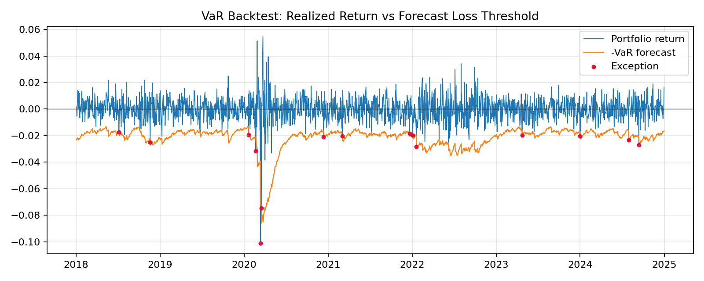
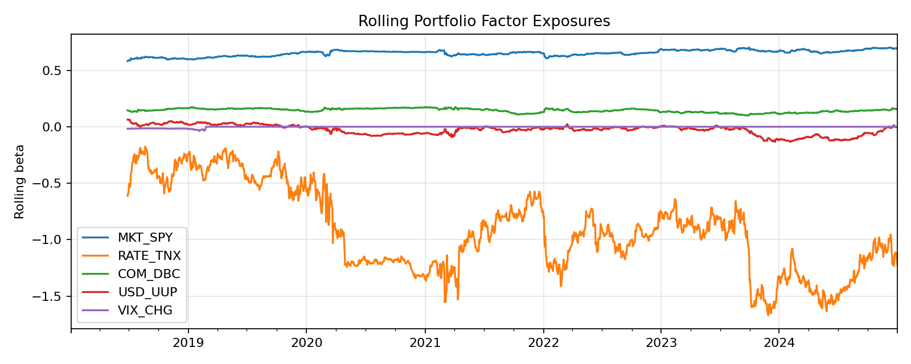
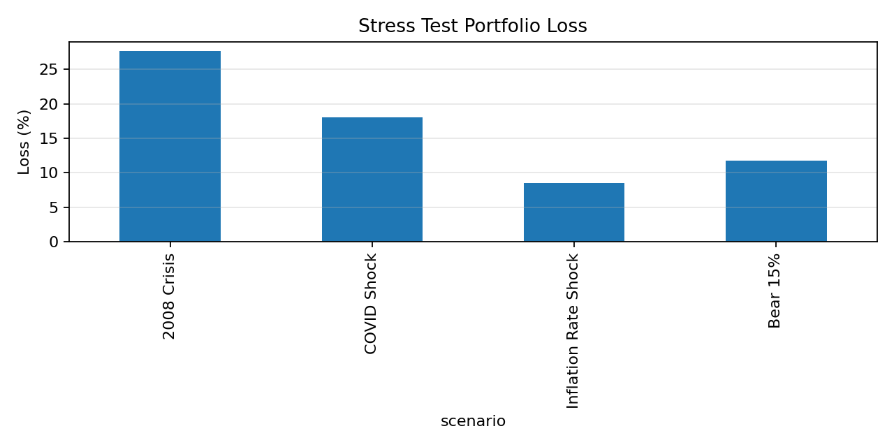
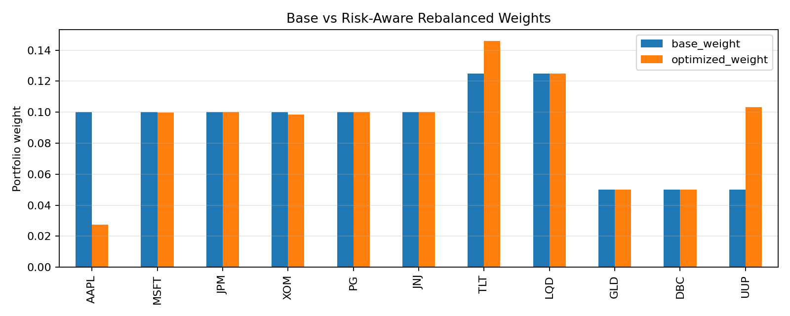

# Multi-Asset Market Risk Framework

This repository covers the workflow in my quantitative risk analyst internship experience: multi-asset factor exposures, Value-at-Risk models, VaR backtesting, stress testing, and risk-aware portfolio rebalancing.

## What It Demonstrates

- **Portfolio risk management:** equities, bonds, commodities, and FX data are mapped to macro risk factors such as equity market, rates, commodities, USD, and volatility.
- **Factor exposure modeling:** full-sample and rolling OLS betas quantify asset and portfolio sensitivity to macro risk drivers.
- **VaR and ES modeling:** historical simulation, parametric normal VaR, and Monte Carlo VaR, improved modeling method with EWMA volatility VaR, and EWMA-t VaR.
- **Backtesting:** Kupiec unconditional coverage, Christoffersen independence, joint conditional coverage, exception counts, and Basel traffic-light diagnostics.
- **Stress testing:** historical and hypothetical scenarios such as 2008 crisis, COVID-style shock, inflation/rate shock, and moderate bear market.
- **Risk-aware rebalancing:** optimization-based reallocation seeks a target reduction in 99% one-day VaR while preserving asset-class constraints.


## Output Files

After running the analysis, the `reports/` folder contains:

- `summary.md`: executive summary of VaR, backtesting, stress tests, and rebalancing.
- `var_metrics.csv`: static VaR and Expected Shortfall metrics.
- `var_backtests.csv`: exception counts and statistical backtest p-values.
- `factor_exposures.csv`: full-sample factor exposures by asset.
- `portfolio_exposures.csv`: aggregate portfolio factor exposure.
- `stress_summary.csv`: portfolio loss estimates under stress scenarios.
- `rebalanced_weights.csv`: base vs optimized weights and risk reduction.
- `figures/`: exposure, VaR backtest, stress loss, and weight comparison charts.

## Sample Results

The deterministic synthetic demo run in this repository currently produces:

- 99% Historical VaR: **2.05%**
- 99% Expected Shortfall: **3.32%**
- Best 99% VaR backtest model: **EWMA t(df=5)** with conditional coverage p-value of **0.647**
- 99% one-day VaR reduction after risk-aware rebalancing: **20.0%**









## Project Structure

```text
src/market_risk/
  backtesting.py    VaR exception tests and Basel traffic-light diagnostics
  config.py         Asset universe, default weights, and stress scenarios
  data.py           Data loading, synthetic data generation, factor construction
  exposure.py       OLS factor betas, rolling exposures, covariance matrices
  rebalancing.py    VaR-constrained portfolio rebalancing optimizer
  stress.py         Scenario loss and asset contribution analysis
  var.py            VaR, ES, Monte Carlo, EWMA, and rolling VaR models
scripts/
  run_analysis.py   End-to-end reproducible workflow
docs/
  methodology.md    Model formulas and design notes
tests/
  test_backtesting.py
  test_var_models.py
```

## Resume Alignment

| Resume bullet | Repository implementation |
| --- | --- |
| Built a multi-asset risk management framework | `config.py`, `data.py`, `exposure.py`, `scripts/run_analysis.py` |
| Implemented and backtested multiple VaR models | `var.py`, `backtesting.py`, `reports/var_backtests.csv` |
| Performed stress testing under market shocks | `stress.py`, `reports/stress_summary.csv` |
| Designed risk-based hedging/rebalancing strategies | `rebalancing.py`, `reports/rebalanced_weights.csv` |


